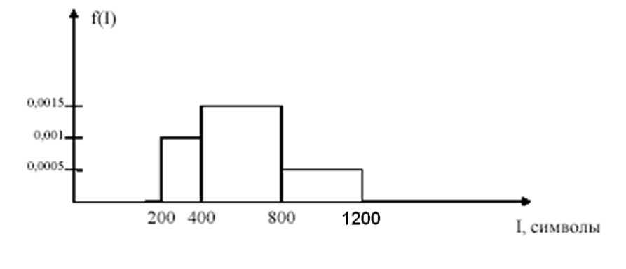

## Вариант 6

В информационно-справочной системе (ИСС) информация хранится в трёх базах данных (БД1, БД2, БД3). При поступлении запроса сначала выполняется поиск информации в БД1, где информация обнаруживается в 60% случаев. Если необходимая информация не обнаруживается, то выполняется поиск в БД2, где информация обнаруживается в 80% случаев. Если информация снова не найдена, то она находится в БД3 (всегда).

Обработка запроса состоит в поиске информации в БД и её считывании с диска. Время поиска - случайная величина, распределённая по равномерному закону в диапазоне от 0,2 до 1,4 мс. Скорость считывания информации с диска – 10 Мбит/с. Объём информации, считываемый по одному запросу (I) – случайная величина. На основании наблюдений установлено, что плотность распределения этой величины может быть приближённо задана графиком на рисунке 1.6.

Требуется определить:
 - среднее время ответа на запрос;
 - вероятность того, что время ответа на запрос превысит 3 мс.

